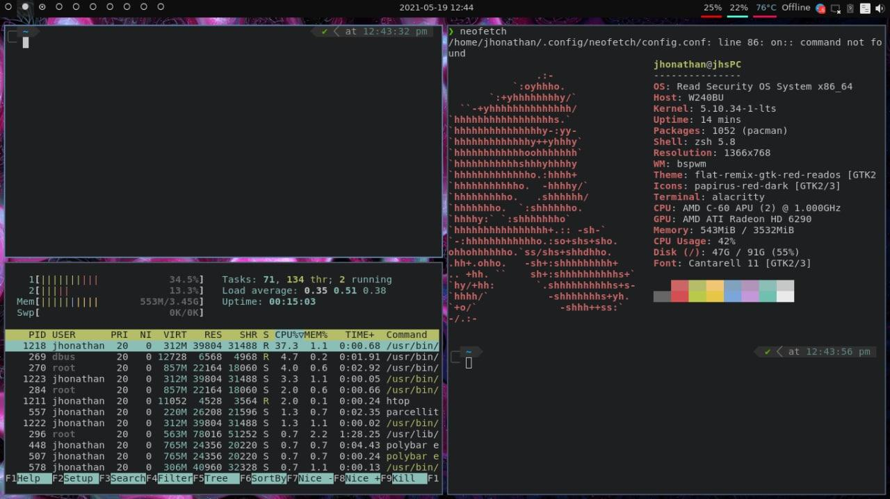

# Arch-linux

Hello there! So, do you wanna install Arch-linux without die in the try? 
...well that's the reason why I made this repo, here you'll find out step by step how is the installation process of Arch Linux, 
and also you'll can see my personal settings (I do use tilling window managers like I3 and BSPWM but if you just wanna install
arch with a normal window manager just skip the extra steps) I hope you to find this repo usefull and never forget click in the star button! Hehehe



# Table of Contents

- [Arch installation](#arch-installation)
  - [Connecting the computer to the internet](#connecting-the-computer-to-the-internet)
  - [Creating the hard disk partitions for the system](#creating-the-hard-disk-partitions)
  - [Mounting the system](#mounting-the-system)
  - [Installing requeriments of the system](#installing-requieriments-of-the-system)
- [Login and window manager](#login-and-window-manager)
- [Basic I3 configuration](#basic-i3-configuration)
- [Basic system utilities](#basic-system-utilities)
  - [Wallpaper](#wallpaper)
  - [Fonts](#fonts)
  - [Audio](#audio)
  - [Monitors](#monitors)
  - [Storage](#storage)
  - [Network](#network)
  - [Systray](#systray)
  - [Notifications](#notifications)
  - [Xprofile](#xprofile)
- [Further configuration and tools](#further-configuration-and-tools)
  - [AUR helper](#aur-helper)
  - [Media Transfer Protocol](#media-transfer-protocol)
  - [File Manager](#file-manager)
  - [Trash](#trash)
  - [GTK Theming](#gtk-theming)
  - [Qt](#qt)
  - [Lightdm theming](#lightdm-theming)
  - [Multimedia](#multimedia)
    - [Images](#images)
    - [Video and audio](#video-and-audio)
  

# Arch installation
First of all for the installation you'll need the image ISO of the OS into an USB booteable, then set off your machine and start the boot process with the USB, then you'll see a black terminal, and there is where we gonna work, don't be scared, the process is not as complicate as you think, just follow step by step the guide and everything's gonna be okay.

If you're not comfortable using the American keyboard you can change it for the installation with this command:
```
//Here "es" is the language of the keyboard!
$ loadkeys es
```

## Connecting the computer to the internet
So, to start with the installation process we need to have an internet connection, and for do that you have two options:
- Connecting your computer to an ethernet cable.
- Connecting your computer to a wifi network.
If you choose the first one option you won't need to do anymore, you already will have internet connection and you can verify it with the command:
```
//If you get a result of the connection with the google's servers so, that means that you already have internet connection
$ ping google.com
```
If you choose the second to option, you have to follow this steps:

- Verify if your network board is active with the command:
```
$ ip link
```
If it isn't so active it with the command:
```
$ ip link set network-board-name up
```
- Now scan the networks in your area to find your wifi network with this command:
```
$ iwlist network-board-name scan
```
Now you have to connect to your wifi network, If your wifi network doesn't have any security protocol (Password) you can connect your computer to it with this command:
```
$ iwconfig network-board-name essid wifi-network-name
```
But if your wifi network does have a security protocol, you have to use one of this commands depending of the kind of protocol your network is.
- WEP network:
```
$ iwconfig network-board-name essid wifi-network-name key:password of the network
```
- WPA network:
```
$ wpa_passphrase wifi-name-network wifi-password > /etc/wifi
//To verify that the data has been saved use the command:
$ cat etc/wifi
//Now stablish the connection with the network
$ wpa_supplicant -B -i network-board-name -D wext -c /etc/wifi

$ dhclient
//Now verify that you're already connected to the internet
$ ping google.com
```

## Creating the hard disk partitions for the system
Ok, to make your hard disk partition for the system, you gotta know which is the storage where you want to install Arch, so to list all the storage drivers of your machine use the command: 
```

$ fdisk -l
```
There you gonna see a list of drivers, and probably your local hard disk is called "sda"
so to open your hard disk to make the partitions use this command:
```
$ fdisk /dev/sda
```
Okay, now you might gotta use the following sytem of commands to establish your table of partitions where gonna live your Arch:

| Key                  | Action                     |
| -------------------- | -------------------------- |
| **o**                | creates a new table        |
| **n**                | creates a new partition    |
| **p**                | show existent partitions   |
| **d**                | delete a partition         |

Establish the partition **sda1** as the primary partition where gonna live the Linux system (Root partition).
Now **sda2** as a secondary partition, this one gonna be the "Home" of your system, where gonna be your personal data.
And the third one is optional, it's called a **swap** partition and in this case gonna be the **sda3** partition.

**The storage assigned of each partition it's your personal desition based on the capacity of you hard disk**
But I could recommend you assign at least 20gb of space to the Root partition and the rest to Home.

Now press the letter **a** and then the number **1** for select **sda1** as your starting partition, and also press **t**  and then **L** and choose the number 82 to make **sda3** the swap partition. And finally press **w** to left the hard disk configuration.

## Mounting the system
- Mounting the Root partition:
```
$ mkfs.ext4 /dev/sda1
$ mount /dev/sda1 /mnt
```
- Mounting the Home partition:
```
$ mkfs.ext4 /dev/sda2
$ mkadir /mnt/home
$ mount /dev/sda2 /mnt/home
```
- Mounting the swap partition:
```
$ mkswap /dev/sda3
```
## Installing the requieriments of the system

List of packages to install for the minimun workable eviroment:
- base
- kernel: Linux-lts
- linux-firmware
- nano
- grub
- networkmanager
- dhcpcd
- netctl
- wpa_supplicant
- dialog

With this command you gonna install Linux in the Root partition:
```
$ pacstrap /mnt base linux-lts linux-firmware nano grub networkmanager dhcpcd netctl wpa_supplicant dialog
```
## Last configurations of the system
```
$ genfstab /mnt >> /mnt/etc/fstab

$ arch-chroot /mnt

$ ln -sf /usr/share/zoneinfo/America/Caracas/etc/localetime
$ nwclock --systoch
$ echo "LANG=es_ES.UTF8" > /etc/locale.conf
$ echo "KEYMAP=es" > /etc/vconsole.conf
$ echo "Name-of-your-machine" > /etc/hostname
$ useradd -m userName
$ passwd userName 
   set_your_password

$ grub-install /dev/sda
$ grub-mkconfig -o /boot/grub/grub.cfg
$ mkinitcpio -P
$ reboot now
```
And now you can disconnect the USB from the computer, and your Arch Linux should me already installed "Without graphic eviroment"

In order to have root privileges we need sudo:

```bash
pacman -S sudo
```

Edit **/etc/sudoers** with nano or vim by uncommenting this line:

```bash
## Uncomment to allow members of group wheel to execute any command
# %wheel ALL=(ALL) ALL
## Add:
# userName ALL=(ALL) ALL
```

Now you can reboot:

```bash
# Exit out of ISO image, unmount it and remove it
exit
umount -R /mnt
reboot
```

After logging in, your internet should be working just fine, but that's only if
your computer is plugged in. If you're on a laptop with no Ethernet ports, you
might have used **[iwctl](https://wiki.archlinux.org/index.php/Iwd#iwctl)**
during installation, but that program is not available anymore unless you have
installed it explicitly. However, we've installed
**[NetworkManager](https://wiki.archlinux.org/index.php/NetworkManager)**,
so no problem, this is how you connect to a wireless LAN with this software:

```bash
# List all available networks
nmcli device wifi list
# Connect to your network
nmcli device wifi connect YOUR_SSID password YOUR_PASSWORD
```

Check [this page](https://wiki.archlinux.org/index.php/NetworkManager#nmcli_examples)
for other options provided by *nmcli*. The last thing we need to do before
thinking about desktop environments is installing **[Xorg](https://wiki.archlinux.org/index.php/Xorg)**:

```bash
sudo pacman -S xorg
```

# Login and window manager

First, we need to be able to login and open some programs like a browser and a
terminal, so we'll start by installing **[lighdm](https://wiki.archlinux.org/index.php/LightDM)**
I3. Lightdm will not
work unless we install a **[greeter](https://wiki.archlinux.org/index.php/LightDM#Greeter)**.
We also need
**[xterm](https://wiki.archlinux.org/index.php/Xterm)**,
Then, a text editor is necessary for editing config files, you can use
**[vscode](https://wiki.archlinux.org/index.php/Visual_Studio_Code)** or jump
straight into **[neovim](https://wiki.archlinux.org/index.php/Neovim)** if you
have previous experience, otherwise I wouldn't suggest it. Last but not least,
we need a browser.

```bash
sudo pacman -S lightdm lightdm-gtk-greeter i3 xterm code firefox
```

Enable *lightdm* service and restart your computer, you should be able to log into
I3 through *lightdm*.

```bash
sudo systemctl enable lightdm
reboot
```

# Basic I3 configuration

Now that you're in I3, you should know some of the default keybindings.

| Key                  | Action                     |
| -------------------- | -------------------------- |
| **mod + return**     | launch xterm               |
| **mod + k**          | next window                |
| **mod + j**          | previous window            |
| **mod + w**          | kill window                |
| **mod + [asdfuiop]** | go to workspace [asdfuiop] |
| **mod + ctrl + r**   | restart qtile              |
| **mod + ctrl + q**   | logout                     |

Before doing anything else, if you don't have a US keyboard, you should
change it using *setxkbmap*. To open xterm use **mod + return**. For example to
change your layout to spanish:

```bash
setxkbmap es
```

Note that this change is not permanent, if you reboot you have to type that
command again. See [this section](#xprofile) for making it permanent, or
follow the natural order of this guide if you have enough time.

There is no menu by default, you have to launch programs through xterm. At this
point, you can pick your terminal emulator of choice and install a program
launcher.

```bash
# Install another terminal emulator if you want
sudo pacman -S alacritty
```

Now open the config file:

```bash
code ~/.config/qtile/config.py
```

At the beginning, after imports, you should find an array called *keys*,
and it contains the following line:

```python
Key([mod], "Return", lazy.spawn("xterm")),
```

Change that line to launch your terminal emulator:

```python
Key([mod], "Return", lazy.spawn("alacritty")),
```

Install a program launcher like
**[dmenu](https://wiki.archlinux.org/index.php/Dmenu)**
or **[rofi](https://wiki.archlinux.org/index.php/Rofi)**:

```bash
sudo pacman -S rofi
```

Then add keybindings for that program:

```python
Key([mod], "m", lazy.spawn("rofi -show run")),
Key([mod, 'shift'], "m", lazy.spawn("rofi -show")),
```

Now restart Qtile with **mod + control + r**. You should be able to open your
menu and terminal emulator with keybindings. If you picked rofi, you can
change its theme like so:

```bash
sudo pacman -S which
rofi-theme-selector
```

That's it for Qtile, now you can start hacking on it and make it your own.
Checkout my custom Qtile config
[here](https://github.com/antoniosarosi/dotfiles/tree/master/.config/qtile).
But before that I would recommend configuring basic utilities like audio,
battery, mounting drives, etc.

# Basic system utilities

In this section we will cover some software that almost everybody needs on their
system. Keep in mind though that the changes we are going to make
will not be permanent. [This subsection](#xprofile) describes how to accomplish
that.

## Wallpaper

First things first, your screen looks empty and black, so you might want to have
a wallpaper not to feel so depressed. You can open *firefox* through *rofi*
using **mod + m** and download one. Then install
**[feh](https://wiki.archlinux.org/index.php/Feh)** or
**[nitrogen](https://wiki.archlinux.org/index.php/Nitrogen)**
and and set your wallpaper:

```bash
sudo pacman -S feh
feh --bg-scale path/to/wallpaper
```

## Fonts

Fonts in Arch Linux are basically a meme, before you run into any problems
you can just use the simple approach of installing these packages:

```bash
sudo pacman -S ttf-dejavu ttf-liberation noto-fonts
```

To list all available fonts:

```bash
fc-list
```

## Audio

There is no audio at this point, we need
**[pulseaudio](https://wiki.archlinux.org/index.php/PulseAudio)**.
I suggest also installing a graphical program to control audio like
**[pavucontrol](https://www.archlinux.org/packages/extra/x86_64/pavucontrol/)**,
because we don't have keybindings for that yet:

```bash
sudo pacman -S pulseaudio pavucontrol
```

On Arch,
[pulseaudio is enabled by default](https://wiki.archlinux.org/index.php/PulseAudio#Running),
but you might need to reboot in order for it to actually start. After rebooting,
you can open *pavucontrol* through *rofi*, unmute the audio, and you should be
just fine.

Now you can set up keybindings for *pulseaudio*, open Qtile's config.py and add
these keys:

```python
# Volume
Key([], "XF86AudioLowerVolume", lazy.spawn(
    "pactl set-sink-volume @DEFAULT_SINK@ -5%"
)),
Key([], "XF86AudioRaiseVolume", lazy.spawn(
    "pactl set-sink-volume @DEFAULT_SINK@ +5%"
)),
Key([], "XF86AudioMute", lazy.spawn(
    "pactl set-sink-mute @DEFAULT_SINK@ toggle"
)),
```

For a better CLI experience though, I recommend using
**[pamixer](https://www.archlinux.org/packages/community/x86_64/pamixer/)**:

```bash
sudo pacman -S pamixer
```

Now you can turn your keybindings into:

```python
# Volume
Key([], "XF86AudioLowerVolume", lazy.spawn("pamixer --decrease 5")),
Key([], "XF86AudioRaiseVolume", lazy.spawn("pamixer --increase 5")),
Key([], "XF86AudioMute", lazy.spawn("pamixer --toggle-mute")),
```

Restart Qtile with **mod + control + r** and your keybindings should work. If
you're on a laptop, you might also want to control the brightness of your screen,
and for that I recommend
**[brightnessctl](https://www.archlinux.org/packages/community/x86_64/brightnessctl/)**:

```bash
sudo pacman -S brightnessctl
```

You can add these keybindings and restart Qtile after:

```python
# Brightness
Key([], "XF86MonBrightnessUp", lazy.spawn("brightnessctl set +10%")),
Key([], "XF86MonBrightnessDown", lazy.spawn("brightnessctl set 10%-")),
```

## Monitors

If you have a multi-monitor system, you surely want to use all your screens.
Here's how **[xrandr](https://wiki.archlinux.org/index.php/Xrandr)** CLI works:

```bash
# List all available outputs and resolutions
xrandr
# Common setup for a laptop and a monitor
xrandr --output eDP-1 --primary --mode 1920x1080 --pos 0x1080 --output HDMI-1 --mode 1920x1080 --pos 0x0
```

We need to specify the position for each output, otherwise it will default to
0x0, and all your outputs will be overlapped. Now if you don't want to calculate pixels
and stuff you need a GUI like
**[arandr](https://www.archlinux.org/packages/community/any/arandr/)**:

```bash
sudo pacman -S arandr
```

Open it with *rofi*, arrange your screens however you want, and then you can
save that layout, which will basically give you a shell script with the exact
*xrandr* command that you need. Save that script, but don't click "apply" just
yet.

For a multi-monitor system, it's recommended to create an instance of a
*Screen* object for each monitor in your Qtile config.

You'll find an array called *screens* which contains only one object
initialized with a bar at the bottom. Inside that bar you can see the default
widgets that come with it.

Add as many screens as you have and copy-paste all widgets, later you can
customize them. Now you can go back to arandr, click *apply*, and then restart
Qtile.

Now your multi-monitor system should work.

## Storage

Another basic utility you might need is automounting external hard drives or
USBs. For that I use **[udisks](https://wiki.archlinux.org/index.php/Udisks)**
and **[udiskie](https://www.archlinux.org/packages/community/any/udiskie/)**.
*udisks* is a dependency of *udiskie*, so we only need to install the last one.
Install also **[ntfs-3g](https://wiki.archlinux.org/index.php/NTFS-3G)**
package to read and write NTFS formatted drives:

```bash
sudo pacman -S udiskie ntfs-3g
```

## Network

We have configured the network through *nmcli*, but a graphical frontend is
more friendly. I use
**[nm-applet](https://wiki.archlinux.org/index.php/NetworkManager#nm-applet)**:

```bash
sudo pacman -S network-manager-applet
```

## Systray

By default, you have a system tray in Qtile, but there's nothing running in it.
You can launch the programs we've just installed like so:

```bash
udiskie -t &
nm-applet &
```

Now you should see icons that you can click to configure drives and networking.
Optionally, you can install tray icons for volume and battery:

```bash
sudo pacman -S volumeicon cbatticon
volumeicon &
cbatticon &
```

## Notifications

I like having desktop notifications as well, for that you need to install
[**libnotify**](https://wiki.archlinux.org/index.php/Desktop_notifications#Libnotify)
and [**notification-daemon**](https://www.archlinux.org/packages/community/x86_64/notification-daemon/):

```bash
sudo pacman -S libnotify notification-daemon
```

For a tiling window manager,
[this is how you can get notifications](https://wiki.archlinux.org/index.php/Desktop_notifications#Standalone):

```bash
# Create this file with nano or vim
sudo nano /usr/share/dbus-1/services/org.freedesktop.Notifications.service
# Paste these lines
[D-BUS Service]
Name=org.freedesktop.Notifications
Exec=/usr/lib/notification-daemon-1.0/notification-daemon
```

Test it like so:

```bash
notify-send "Hello World"
```

## Xprofile

As I have mentioned before, all these changes are not permanent. In order to
make them permanent, we need a couple things. First, install
**[xinit](https://wiki.archlinux.org/index.php/Xinit)**:


```bash
sudo pacman -S xorg-xinit
```

Now you can use *~/.xprofile* to run programs before your window manager starts:

```bash
touch ~/.xprofile
```

For example, if you place this in *~.xprofile*:

```bash
xrandr --output eDP-1 --primary --mode 1920x1080 --pos 0x1080 --output HDMI-1 --mode 1920x1080 --pos 0x0 &
setxkbmap es &
nm-applet &
udiskie -t &
volumeicon &
cbatticon &
```

Every time you login you will have all systray utilities, your keyboard layout
and monitors set.

# Further configuration and tools

## AUR helper

Now that you have some software that allows you tu use your computer without
losing your patience, it's time to do more interesting stuff. First, install an
**[AUR helper](https://wiki.archlinux.org/index.php/AUR_helpers)**, I use
**[yay](https://github.com/Jguer/yay)**:

```bash
sudo pacman -S base-devel git
cd /opt/
sudo git clone https://aur.archlinux.org/yay-git.git
sudo chown -R username:username yay-git/
cd yay-git
makepkg -si
```

With an *Arch User Repository helper*, you can basically install
any piece of software on this planet that was meant to run on Linux.

## Media Transfer Protocol

If you want to connect your phone to your computer using a USB port, you'll
need MTP implementation and some CLI to use it, like
[this one](https://aur.archlinux.org/packages/simple-mtpfs/):

```bash
sudo pacman -S libmtp
yay -S simple-mtpfs

# List connected devices
simple-mtpfs -l
# Mount first device in the previous list
simple-mtpfs --device 1 /mount/point
```

## File Manager

We've done all files stuff through a terminal up to this point, but you can
install graphical or terminal based file managers.
For a graphical one, I suggest
**[thunar](https://wiki.archlinux.org/index.php/Thunar)**
and for a terminal based one,
**[ranger](https://wiki.archlinux.org/index.php/Ranger)**, although this one
is very vim-like, only use it if you know how to move in vim.

```bash
sudo pacman -S thunar ranger
```

## Trash

If you don't want to *rm* all the time and potentially lose files, you need a
trashing system. Luckily, that's pretty easy to do, using
[some of these tools](https://wiki.archlinux.org/index.php/Trash_management#Trash_creation)
such as **[glib2](https://www.archlinux.org/packages/core/x86_64/glib2/)**,
and for GUIs like *thunar* you need **[gvfs](https://www.archlinux.org/packages/extra/x86_64/gvfs/)**:

```bash
sudo pacman -S glib2 gvfs
# CLI usage
gio trash path/to/file
# Empty trash
gio trash --empty
```

With *thunar* you can open the trash clicking on the left panel, but on the command
line you can use:

```bash
ls ~/.local/share/Trash/files
```

## GTK Theming

The moment you have been wating for has arrived, you are finally going to
install a dark theme. I use *Material Black Colors*, so go grab a flavor
[here](https://www.gnome-look.org/p/1316887/) and the matching icons
[here](https://www.pling.com/p/1333360/).

I suggest starting with
*Material-Black-Blueberry* and *Material-Black-Blueberry-Suru*. You can find
other GTK themes [on this page](https://www.gnome-look.org/browse/cat/135/).
Once you have your theme folders downloaded, this is what you do:

```bash
# Assuming you have downloaded Material-Black-Blueberry
cd Downloads/
sudo pacman -S unzip
unzip Material-Black-Blueberry.zip
unzip Material-Black-Blueberry-Suru.zip
rm Material-Black*.zip

# Make your themes available
sudo mv Material-Black-Blueberry /usr/share/themes
sudo mv Material-Black-Blueberry-Suru /usr/share/icons
```

Now edit **~/.gtkrc-2.0** and **~/.config/gtk-3.0/settings.ini** by adding
these lines:

```ini
# ~/.gtkrc-2.0
gtk-theme-name = "Material-Black-Blueberry"
gtk-icon-theme-name = "Material-Black-Blueberry-Suru"

# ~/.config/gtk-3.0/settings.ini
gtk-theme-name = Material-Black-Blueberry
gtk-icon-theme-name = Material-Black-Blueberry-Suru
```

Next time you log in, these changes will be visible. You can also install a
different cursor theme, for that you need
**[xcb-util-cursor](https://www.archlinux.org/packages/extra/x86_64/xcb-util-cursor/)**.
The theme I use is
[Breeze](https://www.gnome-look.org/p/999927/), download it and then:

```bash
sudo pacman -S xcb-util-cursor
cd Downloads/
tar -xf Breeze.tar.gz
sudo mv Breeze /usr/share/icons
```

Edit **/usr/share/icons/default/index.theme** by adding this:

```ini
[Icon Theme]
Inherits = Breeze
```

Now, again, edit **~/.gtkrc-2.0** and **~/.config/gtk-3.0/settings.ini**:

```ini
# ~/.gtkrc-2.0
gtk-cursor-theme-name = "Breeze"

# ~/.config/gtk-3.0/settings.ini
gtk-cursor-theme-name = Breeze
```

Make sure not to mistype the names of your themes and icons, they should
match the names of the directories where they are located, the ones you can
see in this output:

```bash
ls /usr/share/themes
ls /usr/share/icons
```

Remember that you will only see the new theme if you log in again.
There are also graphical frontends for changing themes, I just prefer the
traditional way of editing files though, but you can use
**[lxappearance](https://www.archlinux.org/packages/community/x86_64/lxappearance/)**,
which is a desktop environment independent GUI for this task, and it lets you
preview themes.

```bash
sudo pacman -S lxappearance
```

Finally, if you want tranparency and fancy looking things, install a compositor:

```bash
sudo pacman -S picom
# Run it like so, place it in ~/.xrofile
picom &
```

## Qt

GTK themes will not be applied to Qt programs, but you can use
[**Kvantum**](https://archlinux.org/packages/?name=kvantum-qt5) to change the
default theme:

```bash
sudo pacman -S kvantum-qt5
echo "export QT_STYLE_OVERRIDE=kvantum" >> ~/.profile
```

## Lightdm theming

We can also change the theme of *lightdm* and make it look cooler, because why
not? We need another greeter, and some theme, namely
**[lightdm-webkit2-greeter](https://www.archlinux.org/packages/community/x86_64/lightdm-webkit2-greeter/)**
and  **[lightdm-webkit-theme-aether](https://aur.archlinux.org/packages/lightdm-webkit-theme-aether/)**:

```bash
sudo pacman -S lightdm-webkit2-greeter
yay -S lightdm-webkit-theme-aether
```

These are the configs you need to make:

```ini
# /etc/lightdm/lightdm.conf
[Seat:*]
# ...
# Uncomment this line and set this value
greeter-session = lightdm-webkit2-greeter
# ...

# /etc/lightdm/lightdm-webkit2-greeter.conf
[greeter]
# ...
webkit_theme = lightdm-webkit-theme-aether
```

Ready to go.

## Multimedia

There are dozens of programs for multimedia stuff, check
[this page](https://wiki.archlinux.org/index.php/List_of_applications/Multimedia).

### Images

For image previews, one of the best that I could find is
[geeqie](https://www.archlinux.org/packages/extra/x86_64/geeqie/):

```bash
sudo pacman -S geeqie
```

### Video and audio

No doubt
[vlc](https://wiki.archlinux.org/index.php/VLC_media_player_(Espa%C3%B1ol))
is exactly what you need:

```bash
sudo pacman -S vlc
```
